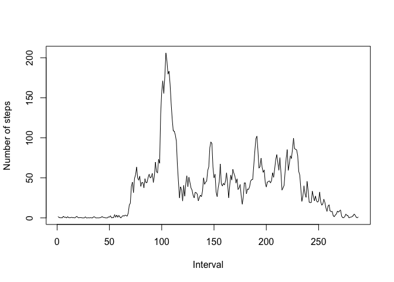

# Reproducible Research: Peer Assessment 1

      
## Loading and preprocessing the data

```r
data <- read.csv("activity.csv")
```


## What is mean total number of steps taken per day?
The ddply function is used to calculate the number of steps per day.


```r
library(plyr)
sumSteps <- ddply(data, "date", summarise, steps = sum(steps, na.rm=TRUE))
hist(sumSteps$steps, breaks=10, col='lightblue', main='Histogram of the number of steps', xlim=c(0,25000), xlab='Number of steps')
```

 

```r
summary(sumSteps$steps)
```

```
##    Min. 1st Qu.  Median    Mean 3rd Qu.    Max. 
##       0    6778   10400    9354   12810   21190
```


## What is the average daily activity pattern?
First, the dates need to be converted into days of the week. A column with this information is added to the dataframe.
Then the average per day is calculated using the ddply function. The results are plotted and the maximum is calculated.


```r
data$day <- factor(weekdays(as.Date(data$date)))
data$day <- factor(data$day, levels= c("Sunday", "Monday", 
    "Tuesday", "Wednesday", "Thursday", "Friday", "Saturday"))
avgByInt <- ddply(data, .(interval), summarise, steps = mean(steps, na.rm=TRUE))
invisible(avgByInt[order(data$day), ])
plot(avgByInt$steps, type='l', xlab='Interval', ylab='Number of steps')
```

 

```r
avgByInt[which.max(avgByInt$steps),]
```

```
##     interval    steps
## 104      835 206.1698
```


## Imputing missing values
The missing values are replaced by the mean of that particular interval for the specific day.


```r
sum(is.na(data$steps))
```

```
## [1] 2304
```

```r
idx <- is.na(data$steps)
modData <- data
avgByDay <- ddply(data, .(day, interval), summarise, steps = mean(steps, na.rm=TRUE))
for (i in 1:length(idx)) {
      if (idx[i]) {
            modData$steps[i] <- avgByDay$steps[which(avgByDay$day==data$day[i] & avgByDay$interval==data$interval[i])]
      }
}
```

Now, the same methods as before can be used to make a histogram and calculate the mean and median.


```r
sumStepsMod <- ddply(modData, "date", summarise, steps = sum(steps, na.rm=TRUE))
hist(sumStepsMod$steps, breaks=10, col='lightblue', main='Histogram of the number of steps', xlim=c(0,25000), xlab='Number of steps')
```

 

```r
summary(sumStepsMod$steps)
```

```
##    Min. 1st Qu.  Median    Mean 3rd Qu.    Max. 
##      41    8918   11020   10820   12810   21190
```
Filling in the missing values slightly changes the values of the minimum, mean, and median of the number of steps.

## Are there differences in activity patterns between weekdays and weekends?
First, a new factor variable is created to indicate if a day is a weekday or in the weekend.

```r
modData$weekend <- factor(modData$day %in% c("Saturday", "Sunday"))
modData$weekend <- revalue(modData$weekend, c("FALSE"="weekday", "TRUE"="weekend"))
```

The mean of the steps is calculated and the plot is made.

```r
avgByWeekend <- ddply(modData, .(weekend, interval), summarise, steps = mean(steps))
library(ggplot2)
qplot(interval, steps, data=avgByWeekend, facets=weekend~., geom="line", xlab="Interval", ylab="Number of steps")
```

 
